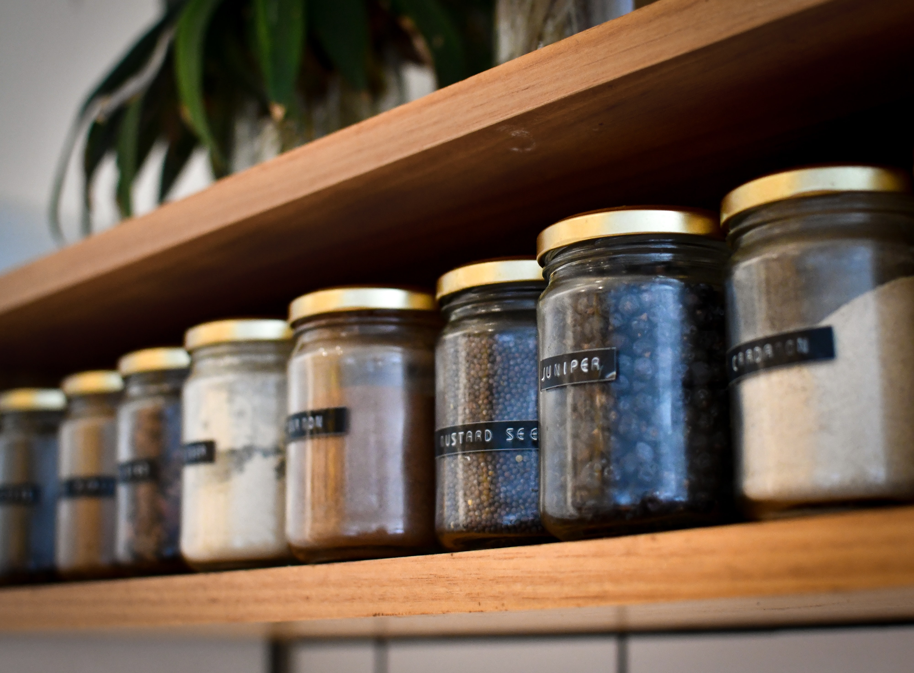

# What's Cookin'


<span>Photo by <a href="https://unsplash.com/@hjmckean?utm_source=unsplash&amp;utm_medium=referral&amp;utm_content=creditCopyText">Heather McKean</a> on <a href="https://unsplash.com/s/photos/pantry?utm_source=unsplash&amp;utm_medium=referral&amp;utm_content=creditCopyText">Unsplash</a></span>

//PROJECT ABSTRACT

## Developers
[Brigette Doelp](https://github.com/BrigetteDoelp)<br>
[Estelle Staffieri](https://github.com/Estaffieri)<br>
[Mike Walker](https://github.com/MichaelEWalker87)

## Instructors
[Robert Gu](https://github.com/BobGu)<br>
[Travis Rollins](https://github.com/kalikoze)

## Project Links
[Project Repo](https://github.com/Estaffieri/whats-cookin)<br>
[Project Spec](https://frontend.turing.io/projects/module-2/refactor-tractor-wc.html)

## Set-up
//check for veracity
  ```
      Fork Repo
      run "npm run" in your terminal
      run "npm start" in your terminal
 ```

## Goals and Objectives
- Build on top of pre-existing code that you did not write and navigate someone else’s codebase

- Develop processes for working remotely and submitting pull requests to perform effective code reviews that help ensure the code is accurate and that everyone understands it
- Make network requests to API endpoints to retrieve and manipulate data
- Refactor pre-existing code and use inheritance to DRY up repetitive logic
- Ensure your app is following best practices for accessibility
- Leverage Sass to DRY up your CSS
- Incorporate Webpack to streamline your workflow process
- Leverage Chai Spies to verify that your DOM manipulation is happening

## Wins & Challenges
//What was great what was not?

## Under the Hood


## Functionality Showcase

<p align="center"></br>
  
</p>

<p align="center"></br>
  
</p>

<p align="center"></br>
  
</p>

<p align="center"></br>
  
</p>
